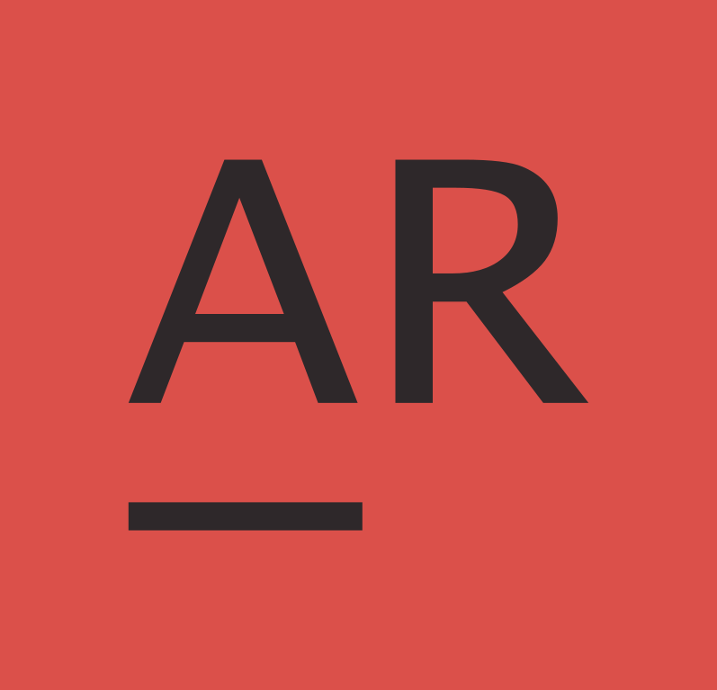

<div align="center">

</div>

<h1 align="center"><a href="https://www.andrewrichardson.info/" target="_blank" rel="noopener noreferrer">andrewrichardson.info</a></h1>

<p align="center">Personal software engineering portfolio</p>

## 📖 Installation

To install the project, simply clone the repository, and install the required node modules with:

```sh
yarn install
```

## 🚀 Getting Started

```sh
yarn start
```

Runs the app in the development mode.\
Open [http://localhost:3000](http://localhost:3000) to view it in the browser.

## 🧪 Running the Testing Suite

```PowerShell
yarn test
```

Launches the test runner in the interactive watch mode.

## 🔨 Building for Production

```sh
yarn build
```

Builds the app for production to the `build` folder.

<br/>
<br/>

_<p style="font-size: 12px">Inspired by <a href="https://brittanychiang.com/" target="_blank" rel="noopener noreferrer">brittanychiang.com</a></p>_
